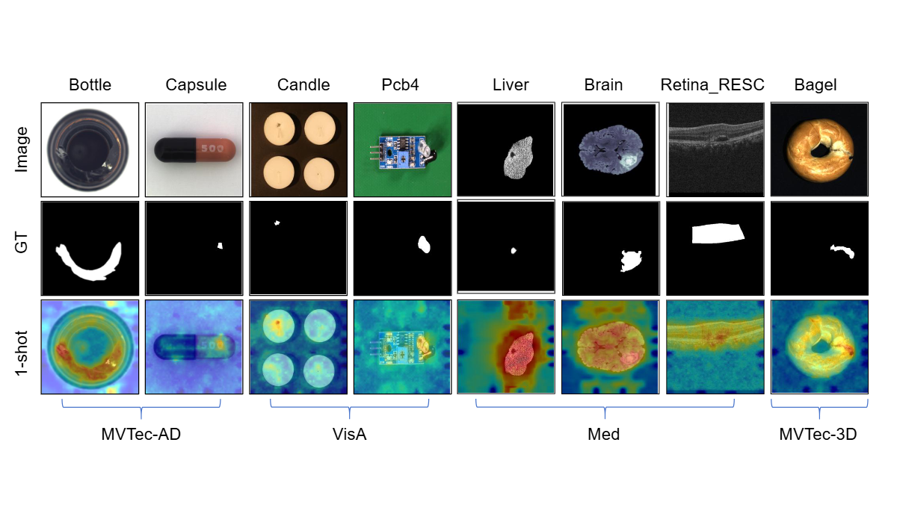

[CLIP-LMFA: Few-Shot Anomaly Detection via Large Language Model-Driven Hybrid Prompts and Multi-Scale Adaptive Fusion](https://arxiv.org/abs/2409.00556)
---
This repository contains the official PyTorch implementation of 
[CLIP-LMFA: Few-Shot Anomaly Detection via Large Language Model-Driven Hybrid Prompts and Multi-Scale Adaptive Fusion](https://arxiv.org/abs/2409.00556)

<p align="center">
    
    <br>
    <em>One-shot anomaly segmentation results.</em>
</p>

## Prerequisites

For dependencies see `poetry.yaml`.

### Install python dependencies
```
poetry install
```

### Download evaluation datasets
* **MVTec-AD** dataset can be downloaded from https://www.mvtec.com/company/research/datasets/mvtec-ad
* **VisA** dataset can be downloaded from https://paperswithcode.com/dataset/visa

## Running CLIP-LMFA
The algorithm does not require any funetuning nor auxiliary training datasets.
`scripts/run_fade.py` allows running evaluation on various datasets and:
1) compute text and visual features, the type of features, CLIP or GEM, is specified through command line arguments.
2) build a memory bank for few-shot anomaly detection if the non-zero number of shots is chosen.

To evaluate on a custom dataset please use `datasets.BaseDataset` as a base class. 
For the full set of command line arguments please refer to the click descriptions in `scripts/run_fade.py`.

### Few-shot settings
Below you can find examples of running **few-shot** CLIP-LMFA 
with language- and vision-guided anomaly classification and segmentation. 

#### Few-shot language- and vision-guided AC and AS
```
DATASET=mvtec
DATASET_PATH=../mvtec
VIS_FEATURE=clip
SEG_FEATURE=gem
CLASS_FEATURE=clip
SHOTS=1
SEED=0

python scripts/run_fade.py \
  --dataset-name $DATASET \
  --dataset-path $DATASET_PATH
  --experiment-name $DATASET/fewshot/cm_both_sm_both_${CLASS_FEATURE}_${SEG_FEATURE}_${VIS_FEATURE}/img_size_${SZ}/shot_${SHOTS}/seed_${SEED} \
  --classification-mode both \
  --segmentation-mode both \
  --shots $SHOTS \
  --seed $SEED \
  --language-classification-feature $CLASS_FEATURE \
  --language-segmentation-feature $SEG_FEATURE \
  --vision-feature $VIS_FEATURE \
  --vision-segmentation-multiplier 3.5 \
  --vision-segmentation-weight 0.85
```

To perform language- or vision-guided only AC and AS please set `classification-mode` and `segmentation-mode` 
to `language` or `vision` respectively.

## Citation
If our work is helpful for your research please consider citing:

```
@misc{li2024fade,
      title={FADE: Few-shot/zero-shot Anomaly Detection Engine using Large Vision-Language Model}, 
      author={Yuanwei Li and Elizaveta Ivanova and Martins Bruveris},
      year={2024},
      eprint={2409.00556},
      archivePrefix={arXiv},
      primaryClass={cs.CV},
      url={https://arxiv.org/abs/2409.00556}, 
}
```